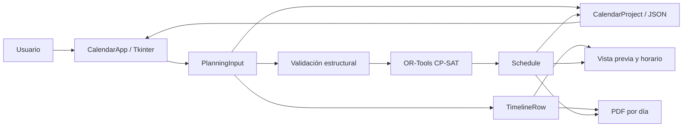

# Arquitectura y flujo de datos

[← Guía de uso](01-guia-de-uso.md) · [Inicio](../README.md) · [Planificación →](03-planificacion.md)

## Vista general

La aplicación es un proceso Python local. Tkinter ejecuta la interfaz y sus
callbacks; OR-Tools busca una asignación de clases; los documentos se almacenan
en JSON y ReportLab produce el PDF. No existe backend HTTP ni servicio externo.

## Mapa del código

Todas las rutas de esta tabla están bajo `src/scholar_calendar/`.

| Módulo | Responsabilidad |
| --- | --- |
| `models.py` | Entidades, configuración, construcción de turnos y franjas. |
| `clock.py` | Inicio por defecto y utilidades de conversión de horas. |
| `defaults.py` | Centro vacío que usa la aplicación al iniciar y limpiar. |
| `validation.py` | Consistencia de recursos, referencias, reloj y franjas. |
| `solver.py` | Modelo CP-SAT, resolución y clases asignadas. |
| `timeline.py` | Actividades de un día: clases, cambios, pausas y huecos. |
| `config.py` | Lectura y serialización de la configuración, incluidas franjas exactas. |
| `project_file.py` | Documento actual con configuración y horario opcional. |
| `schedule_file.py` | Formato de horario guardado y compatibilidad con archivos anteriores. |
| `storage.py` | Escritura JSON mediante reemplazo atómico. |
| `desktop.py` | Ventanas, formularios, edición de recursos y coordinación de acciones. |
| `configuration_overview.py` | Resumen completo de configuración y acceso a editores. |
| `schedule_grid.py` | Cuadrícula Canvas, desplazamiento y selección por asignatura. |
| `subject_details.py` | Texto de las restricciones relevantes para una asignatura. |
| `restriction_note.py` | Nota amarilla con borde discontinuo y desplazamiento interno. |
| `theme.py` | Estilos ttk, paleta y elementos gráficos de los controles. |
| `pdf.py` | Exportación A4 horizontal con una página por día. |
| `example.py` | Ejemplo de consola independiente de la interfaz. |
| `__init__.py` | Exportaciones del paquete para el dominio y la resolución. |

Los módulos de dominio no importan Tkinter. `desktop.py` concentra el control de
la aplicación y sigue siendo su archivo más grande. Los componentes visuales
extraídos tienen responsabilidades acotadas; no hay un framework MVC adicional.

## Tres estados que deben mantenerse separados

| Estado en `CalendarApp` | Significado |
| --- | --- |
| `planning` | Configuración aplicada más reciente; también alberga las reglas que se editan dentro del diálogo. |
| Variables Tk y listas de recursos | Valores de los formularios durante una edición. |
| `schedule_planning` + `schedule` | Configuración original y resultado del último horario generado o cargado. |

`PlanningInput` es una dataclass congelada: no se reasignan directamente sus
atributos. Sin embargo, contiene diccionarios, por lo que no es profundamente
inmutable. El código utiliza `dataclasses.replace` y copia los mapas al editar.
El diálogo guarda una copia profunda de la configuración para poder cancelar.

No se debe usar `planning` para rotular un horario antiguo: podría contener
nuevas horas, nombres o restricciones. La cuadrícula, la nota y el PDF consultan
`schedule_planning`. Guardar conserva ambos estados si son distintos.

## Ciclo de una edición

1. `_open_editor(section)` conserva una copia de `planning` y la semana visible.
2. Muestra una página del `Toplevel` reutilizable, centra el diálogo y captura el
   foco con `grab_set`. Solo se ve el editor elegido.
3. Los callbacks actualizan listas, asociaciones, variables y reglas.
4. `_apply_editor()` llama a `_sync_planning()`: lee campos, construye la nueva
   configuración y la valida. Si hay un error, mantiene abierto el editor.
5. `_set_planning()` reconstruye controles y resumen a partir del modelo válido.
6. `_close_editor()` libera el foco, oculta el diálogo y restaura la semana del
   horario. El horario generado permanece asociado a su configuración original.

Cancelar sigue el mismo cierre, pero primero restaura la copia inicial. Los
nombres actúan como identificadores: `_update_resource_rules()` conserva los
bloqueos y las parejas al renombrar y retira referencias al eliminar recursos.
Los selectores se actualizan para no ofrecer recursos borrados.

## Generación, guardado y carga

`_generate()` sincroniza la configuración, comprueba los recursos mínimos y llama
a `solve()`. Solo al recibir un resultado sustituye `schedule` y
`schedule_planning`. Si falla, conserva el resultado anterior y muestra el error.
La búsqueda tiene un límite de 10 segundos y ocurre en el hilo de Tk: no hay
worker, barra de progreso ni cancelación de la búsqueda.

`_save()` recoge la configuración actual y construye un `CalendarProject` con el
horario opcional. `_load()` lee y valida el documento antes de sustituir el estado
de la ventana. Un error de archivo no debe dejar la aplicación a medio cargar.
`document_path` conserva el nombre sugerido para el siguiente guardado; no
representa un historial ni una suscripción al archivo.

`_clear_project()` elimina el estado en memoria y vuelve a `default_planning()`.
No borra archivos. Los detalles de persistencia están en [Formatos](04-formatos.md).

## Conservación de horas importadas

La configuración puede contener intervalos explícitos distintos del reloj actual.
La interfaz guarda firmas de reloj y dimensiones del ciclo al cargar o aplicar:

- `_clock_signature()`: inicio, duración, cambios y pausas.
- `_slot_signature()`: semanas, turnos por día y sábados activos.

Si ambas firmas permanecen iguales, `_sync_planning()` conserva las franjas
exactas, incluso cuando difieren entre semanas. Si se cambia el reloj o la
estructura del ciclo, reconstruye las franjas usando el formulario. La vista
previa del reloj representa una jornada de referencia; no es un editor individual
de las horas de cada semana.

## Renderizado y selección

`daily_rows()` proporciona las filas comunes que utilizan la vista previa,
la cuadrícula y el PDF. Así se mantiene un único criterio para merienda, comida
y tiempo libre. La cuadrícula y el PDF omiten las filas «Cambio de clase»; las
vistas previas las incluyen.

`ScheduleGrid` dibuja cabecera y cuerpo en dos Canvas con desplazamiento
horizontal sincronizado. `GridRow.values` contiene los textos; `subjects` vincula
cada celda con una asignatura, y `span_from` combina las columnas desde el índice
indicado hasta el final. Merienda usa `span_from=2` para conservar día y horas.

El índice de elementos del Canvas permite identificar la asignatura bajo el
puntero después de desplazar la tabla. El resaltado cambia solo las celdas de esa
asignatura. No identifica profesores ni modifica clases. `RestrictionNote`
restringe su altura para dejar espacio a la cuadrícula.

## Diseño visual

El tema mantiene los controles ttk y sus bindings nativos. Los botones y tarjetas
usan pequeñas imágenes Tk con bordes redondeados que se reutilizan por estado.
Las referencias se conservan en `root._theme_images` para evitar que Python las
libere mientras se muestran.

Tk repite las zonas centrales de esas imágenes al rellenar superficies. Las
tarjetas usan una imagen central amplia para evitar miles de dibujos pequeños en
macOS. Las barras conservan nombres de elemento terminados en `thumb` y `trough`,
necesarios para los bindings estándar de arrastre.

La paleta de la interfaz está en `theme.py`. El horario, la nota y el PDF tienen
además colores semánticos propios para pausas y selección; no hay temas dinámicos
ni modo oscuro.
